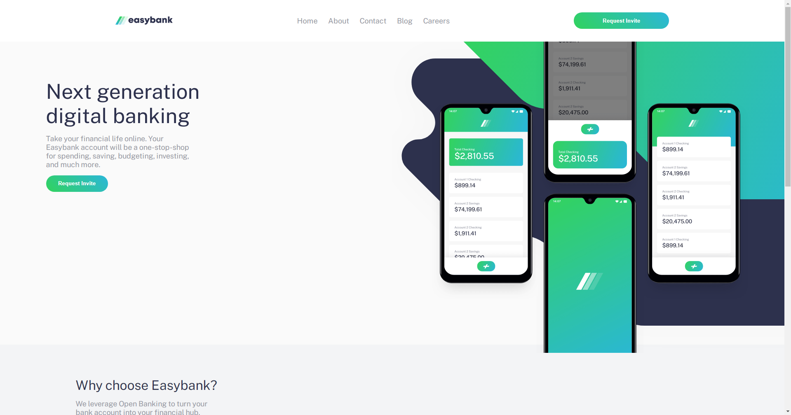
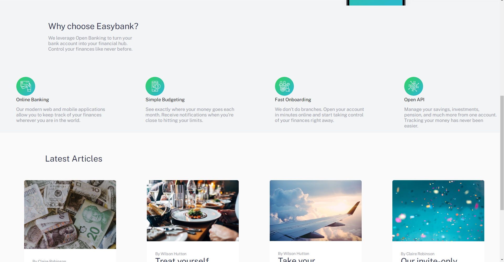
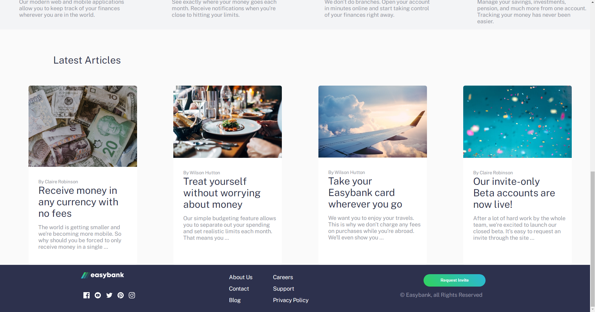
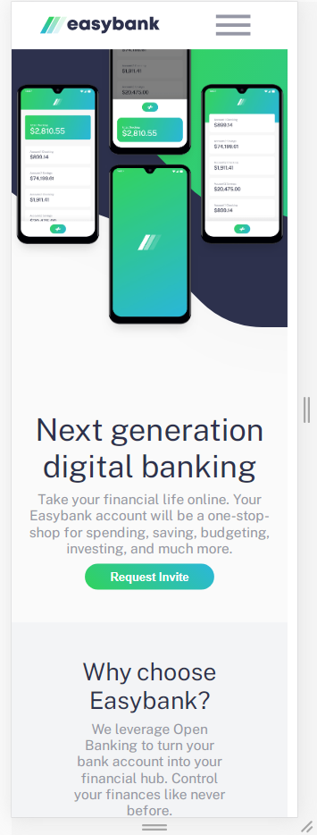
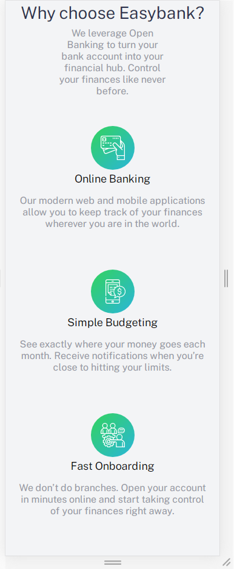
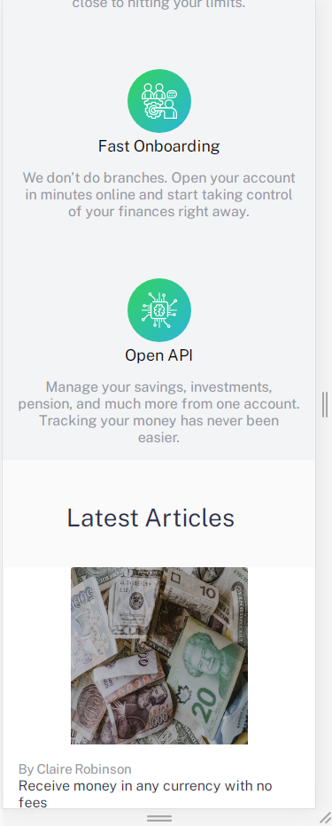
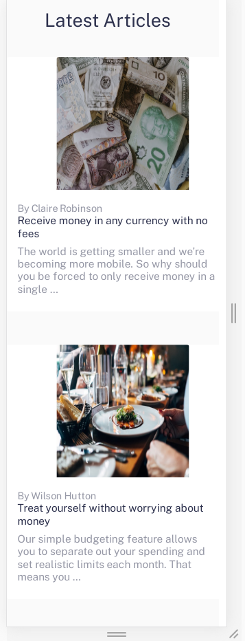
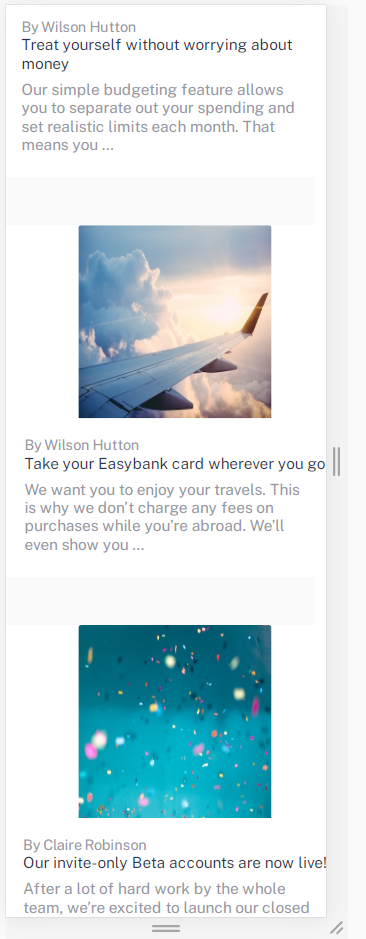
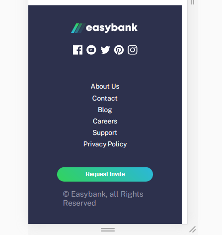

  <a href="#-tecnologias">Tecnologias</a>&nbsp;&nbsp;&nbsp;|&nbsp;&nbsp;&nbsp;
  <a href="#-projeto">Projeto</a>&nbsp;&nbsp;&nbsp;

## 🚀 Tecnologias

Esse projeto foi desenvolvido com as seguintes tecnologias:

- HTML
- SCSS
- JavaScript

## 💻 Projeto

O easy bank é um projeto de site para um banco fictício e conta com layout responsivo.

 
<h1> DESKTOP DESIGN </h1>

  
  
  

<h1> MOBILE DESIGN </h1>

  
  
  
  
  
  

